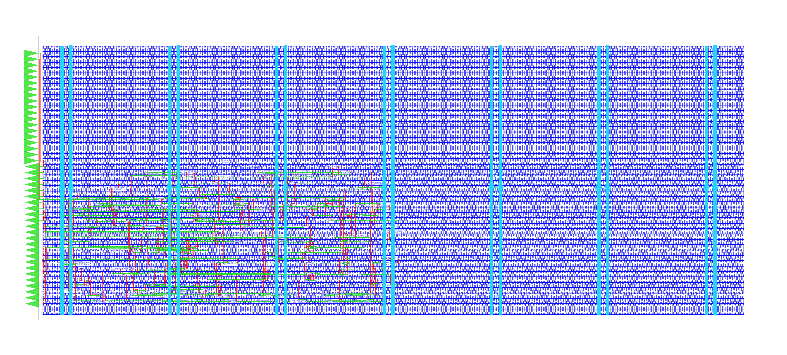

# heiChips2025_project


## TODOs

- [ ] Find out interface of RAM (R/W, data, clock etc.)
- [ ] Analayze size requirements
- [ ] 
- [ ] 
- [ ] 
- [ ] 

## Project idea
Our project idea was to fit a small 8-bit core on our tile. We wanted to use the SRAM on the chip as RAM for our core and the FPGA fabric for routing between the core and SRAM, and for housing one custom instruction that could be dynamically reconfigured by triggering a partial FPGA reconfiguration, while the connection to the SRAM stays intact and the core can ideally keep working.
On our quest to finding a suitable small core, we found the SAP (Simple-As-Possible Computer) core. This was first described in the book "Digital Computer Electronics" by Albert Paul Malvino and Jerald A. Brown. SAP-2 and 3 are Turing-complete [1](#ref1). There is source code under an MIT license and an extensive documentation by Austin Morlan available under [2](#ref2), [3](#ref3), [4](#ref4). This was the starting point for this project.

## Approach 1: SAP-1 
In our quest to finding a suitable small core, we found the SAP-1 implementation by Austin Morlan [2](#ref2). It is a very minimal 8-bit core with 8-bit instructions and two 8-bit registers. Aside from the registers, it has an adder module, a PC, an instruction register, a memory and a controller. Those modules communicate through an 8-bit bus. Austin Morlan's SAP-1 implementation only supports 4 instructions: 
```
[0000] LDA $X Load the value at memory location $X into A.
[0001] ADD $X Add the value at memory location $X to A and store the sum in A.
[0010] SUB $X Subtract the value at memory location $X from A and store the difference in A.
[1111] HLT    Halt execution of the program
``` 
[Fig 1: the four instructions SAP-1 supports taken from [2]](#ref2)  

SAP-1 has a 16-byte-memory that can store 16 8-bit words. We implemented this memory on our tile since we had enough space because the core is so small. For getting an area estimate we ran the physical implementation of the design by using the provided toolchain with librelane etc. We hardcoded a program into the RAM, which was also given on Austin Morlan's page. It uses all four instructions and can be seen below.
``` 
$0 |   0D  // LDA [$D]   Load A with the value at address $D  
$1 |   1E  // ADD [$E]   Add the value at address $E to A  
$2 |   2F  // SUB [$F]   Subtract the value at address $F from A
$3 |   F0  // HLT        Stop execution
```
The instructions are executed over 6 stages, each stage takes one clock cycle to complete. The first three stages fetch the next instruction from memory 




## Approach 2: SAP-3
[3](#ref3)


The source code for all three SAP versions can be found here: [4](#ref4)


## System overview


## References
[1] <a id="ref1"> https://en.wikipedia.org/wiki/Simple-As-Possible_computer  
[2] <a id="ref2"> https://austinmorlan.com/posts/fpga_computer_sap1/  
[3] <a id="ref3"> https://austinmorlan.com/posts/fpga_computer_sap3/  
[4] <a id="ref4"> https://code.austinmorlan.com/austin/2023-fpga-computer  
